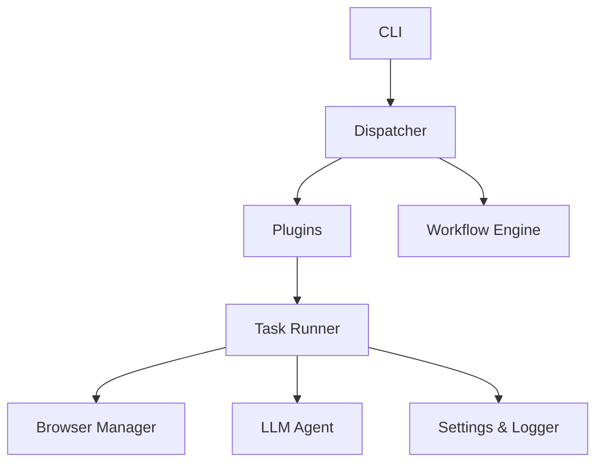
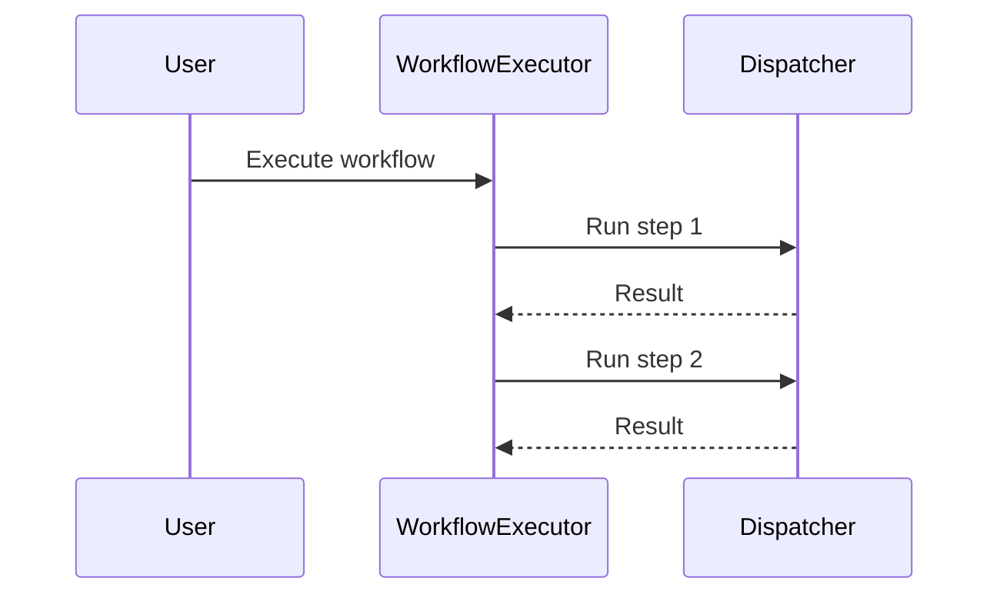

# OpenAgent-Lite

OpenAgent-Lite is a lightweight Python automation project that combines a simple command-line interface, plugin-based action registration, an LLM-assisted task parser, and a workflow engine for coordinating multiple automation actions.

## Overview

The repository currently focuses on a modular automation workflow with these building blocks:

- a CLI entrypoint for manual interaction
- a dispatcher for routing named actions
- a plugin system for registering action implementations
- a workflow engine for chaining multiple dispatcher calls
- browser automation through Selenium and Chrome
- optional LLM-based task decomposition through Ollama
- centralized settings and structured logging

## Key Features

- Interactive command-line automation menu
- Browser automation for common web actions
- File and folder operations
- Screenshot capture
- Email sending with optional attachments
- Web scraping and PDF download helpers
- Optional LLM-driven task decomposition via Ollama
- Plugin-based action registration
- Lightweight workflow execution for sequential tasks
- Centralized configuration and logging

## Technology Stack

| Area | Technologies |
| --- | --- |
| Language | Python 3.13+ |
| Browser automation | Selenium, Chrome WebDriver |
| LLM integration | Ollama, requests |
| Scheduling | schedule |
| UI automation | pyautogui |
| Image handling | Pillow |
| Environment management | python-dotenv |
| Testing | pytest |

## Current Architecture Overview

The application follows a simple layered structure:



### Runtime flow

1. The CLI collects user input and calls the dispatcher.
2. The dispatcher executes registered actions or plugin-backed actions.
3. The workflow engine can orchestrate several dispatcher calls in sequence.
4. Individual actions use the shared task runner, browser manager, settings, and logger modules.

## Folder Structure

```text
src/
  actions/
    browser/
    task_runner.py
  app_logging/
  cli/
  config/
  dispatcher/
  llm/
  plugins/
  workflow/
  browser_manager.py
  logger.py
  llm_agent.py
  main.py
  scheduler.py
  task_runner.py
  task_utils.py
tests/
  test_browser_manager.py
  test_dispatcher.py
  test_llm_service.py
  test_logger.py
  test_plugins.py
  test_settings.py
  test_workflow.py
```

## Installation

1. Clone the repository.
2. Create and activate a virtual environment:

```bash
python -m venv .venv
source .venv/bin/activate
```

On Windows PowerShell:

```powershell
python -m venv .venv
.\.venv\Scripts\Activate.ps1
```

3. Install dependencies:

```bash
pip install -r requirements.txt
```

4. If you want to use the LLM-based task parser, make sure Ollama is available and reachable at the configured host.

## Environment Variables

Copy the example environment file and adjust values as needed:

```bash
copy .env.example .env
```

The application reads the following settings from the environment:

| Variable | Purpose | Default |
| --- | --- | --- |
| GMAIL_EMAIL | Email sender address | empty |
| GMAIL_PASSWORD | Email password or app password | empty |
| OLLAMA_HOST | Ollama service URL | http://localhost:11434 |
| OLLAMA_MODEL | Ollama model name | phi3:3.8b-mini-128k-instruct-q4_0 |
| BROWSER_TIMEOUT | Browser timeout in seconds | 30 |
| DOWNLOAD_DIR | Download destination | downloads/ |
| LOGS_DIR | Log output directory | logs/ |
| DOWNLOADED_IMAGES_DIR | Image download location | downloaded_images/ |
| SCREENSHOT_PATH | Screenshot output path | screenshot.png |
| SMTP_SERVER | SMTP host | smtp.gmail.com |
| SMTP_PORT | SMTP port | 587 |
| LOG_LEVEL | Logging level | INFO |

## Running the Application

Start the interactive CLI from the project root:

```bash
python src/main.py
```

To run the menu non-interactively and exit immediately after selecting the exit option:

```bash
echo 16 | python src/main.py
```

## Running Tests

The repository includes unit tests for the dispatcher, browser manager, settings, logger, plugins, workflow engine, and LLM service:

```bash
python -m pytest -q
```

## Workflow Engine Overview

The workflow engine is an additive orchestration layer built on top of the dispatcher. It lets you define an ordered sequence of executable steps and collects results for each step.



A workflow stops as soon as a step fails and returns the results collected so far.

## Plugin Architecture Overview

Plugins provide a lightweight mechanism for registering actions without changing the dispatcher interface. Each plugin defines a name and an `execute()` method and is discovered automatically from the plugins package.

## Dispatcher Overview

The dispatcher is the main routing layer for action execution. It:

- registers named actions and plugin-backed actions
- executes registered callables
- preserves the existing public action names used by the CLI

## Example Usage

### Manual CLI

Run the app and choose an option from the menu for tasks such as:

- opening YouTube or Google
- searching the web
- downloading PDFs
- sending an email
- taking a screenshot
- writing to a file
- using the LLM-assisted task parser

### Workflow example

```python
from dispatcher.dispatcher import Dispatcher
from workflow.engine import Workflow, WorkflowExecutor, WorkflowStep

dispatcher = Dispatcher()
dispatcher.register("greet", lambda: "hello")
dispatcher.register("echo", lambda value: value)

workflow = Workflow([
    WorkflowStep("greet"),
    WorkflowStep("echo", args=("world",)),
])

executor = WorkflowExecutor(dispatcher)
results = executor.execute(workflow)
```

## Future Roadmap

Possible next steps for the project include:

- expanding the action catalog
- improving error handling for browser and LLM actions
- adding richer workflow composition features
- improving plugin packaging and discovery
- documenting deployment and operational usage patterns

## Contributing

Contributions are welcome. If you would like to improve the project, please:

1. open an issue describing the enhancement or bug fix
2. create a branch for your work
3. submit a pull request with a clear summary of the change

## License

This repository does not currently include a dedicated license file. If you plan to distribute or reuse the project publicly, add an appropriate license before doing so.
