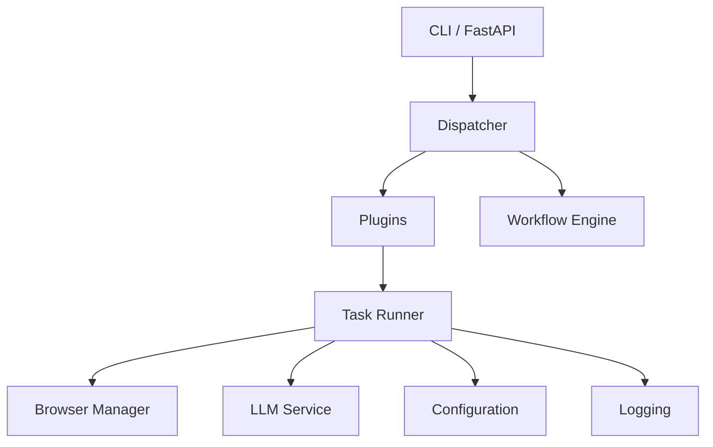
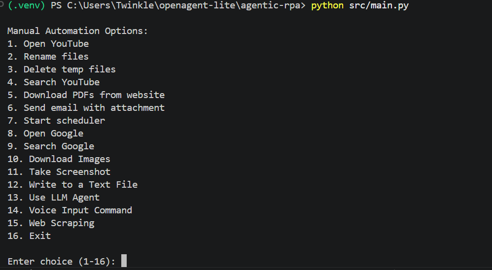
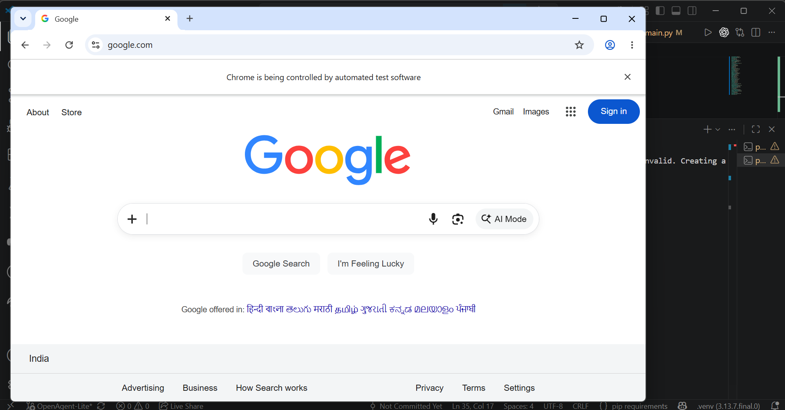
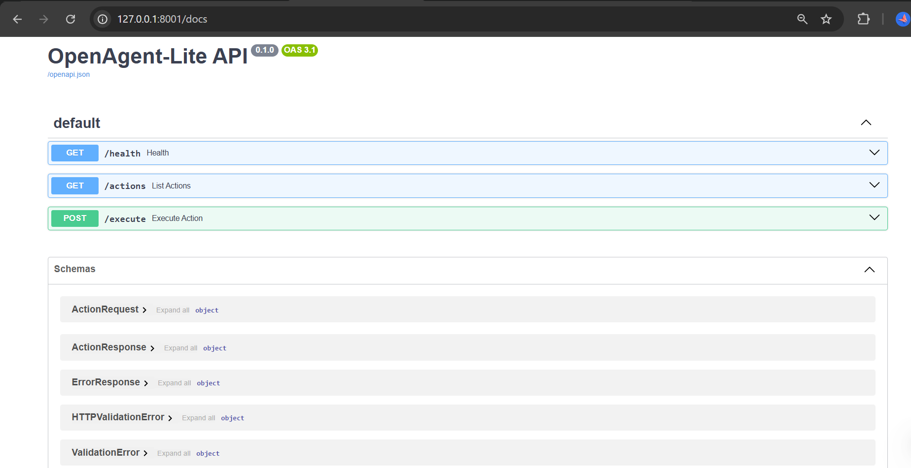

# OpenAgent-Lite


> A modular AI-powered automation framework built with Python that combines browser automation, workflow orchestration, plugins, and REST APIs.

OpenAgent-Lite is a lightweight automation framework that executes browser, desktop, and file automation tasks through a clean and extensible architecture. It supports both an interactive CLI and a FastAPI-based REST API while emphasizing modular design, maintainability, and software engineering best practices.

---

## 🎥 Demo

https://github.com/TwinkleGhodki/OpenAgent-Lite/blob/OpenAgent-Lite/assets/demo.mp4

---

## ✨ Features

| Feature | Description |
|----------|-------------|
| AI Task Planning | Natural language task decomposition using Ollama(Gemma 3 / Phi-3) |
| Browser Automation | Selenium-based browser automation |
| REST API | Execute automation through FastAPI endpoints |
| Plugin System | Easily add new automation actions |
| Workflow Engine | Execute multi-step automation workflows |
| Workflow Persistence | Save and load workflows as JSON |
| Email & File Automation | Email, screenshots, downloads, and file operations |
| Configuration | Environment-based settings using `.env` |
| Structured Logging | Centralized logging and error tracking |
| Testing | 21 automated unit tests using Pytest |
| CI/CD | GitHub Actions workflow |
| Docker | Containerized deployment |

---

## 🛠 Tech Stack

| Category | Technologies |
|----------|--------------|
| Language | Python 3.13 |
| Backend | FastAPI |
| Browser Automation | Selenium |
| AI Integration | Ollama(Gemma 3 / Phi-3) |
| Automation | PyAutoGUI |
| Web Parsing | BeautifulSoup |
| Configuration | python-dotenv |
| Testing | Pytest |
| CI/CD | GitHub Actions |
| Deployment | Docker |

---

## 🏗 Architecture



### Request Flow

```
CLI / REST API
       │
       ▼
 Dispatcher
       │
 Plugins / Workflow
       │
 Task Runner
       │
 Browser • LLM • File System • Logging
```

The modular architecture allows new features to be added without modifying the core execution flow.

---

# 📸 Project Preview

### Interactive CLI



---

### Browser Automation (Selenium)



---

### FastAPI Swagger Documentation



---

## 📁 Project Structure

```text
OpenAgent-Lite
│
├── src/
│   ├── actions/
│   ├── api/
│   ├── app_logging/
│   ├── cli/
│   ├── config/
│   ├── dispatcher/
│   ├── llm/
│   ├── plugins/
│   ├── workflow/
│   └── main.py
│
├── tests/
├── .github/workflows/
├── Dockerfile
├── requirements.txt
├── .env.example
└── README.md
```

---

## 🎯 Project Highlights

OpenAgent-Lite was built to demonstrate modern software engineering practices through a modular automation framework.

Key concepts implemented include:

- Command Pattern (Dispatcher)
- Plugin-based architecture
- Workflow orchestration with JSON persistence
- FastAPI REST API
- Browser automation using Selenium
- AI-assisted task planning with Ollama(Gemma 3 / Phi-3)
- Centralized configuration and structured logging
- Automated testing with Pytest
- Continuous Integration using GitHub Actions
- Dockerized deployment

---

# 🚀 Getting Started

## Prerequisites

- Python 3.13+
- Google Chrome & ChromeDriver
- Git
- Ollama *(optional)*
- Docker *(optional)*

---

## ⚙️ Installation

### Clone the repository

```bash
git clone https://github.com/TwinkleGhodki/OpenAgent-Lite.git
cd OpenAgent-Lite
```

### Create a virtual environment

**Windows**

```powershell
python -m venv .venv
.\.venv\Scripts\Activate.ps1
```

**Linux / macOS**

```bash
python3 -m venv .venv
source .venv/bin/activate
```

### Install dependencies

```bash
pip install -r requirements.txt
```

---

## 🔐 Environment Configuration

Create a `.env` file from the provided template.

**Windows**

```powershell
copy .env.example .env
```

**Linux / macOS**

```bash
cp .env.example .env
```

Update the required values in the `.env` file.

| Variable | Purpose |
|----------|---------|
| GMAIL_EMAIL | Sender email |
| GMAIL_PASSWORD | Gmail App Password |
| OLLAMA_HOST | Ollama server URL |
| OLLAMA_MODEL | LLM model |
| BROWSER_TIMEOUT | Browser timeout |
| DOWNLOAD_DIR | Download directory |
| LOGS_DIR | Log directory |
| SCREENSHOT_PATH | Screenshot location |
| SMTP_SERVER | SMTP host |
| SMTP_PORT | SMTP port |

> **Note:** Keep your `.env` file private and never commit it to GitHub.
---

# ▶️ Running the Application

OpenAgent-Lite supports both a **CLI** and a **REST API**.

## CLI

Launch the interactive application:

```bash
python src/main.py
```

---

## REST API

Start the FastAPI server:

```bash
uvicorn src.api.main:app --reload
```

Access the API at:

| Service | URL |
|---------|-----|
| API | http://127.0.0.1:8000 |
| Swagger UI | http://127.0.0.1:8000/docs |
| ReDoc | http://127.0.0.1:8000/redoc |

---

# 🌐 API Endpoints

| Method | Endpoint | Description |
|---------|----------|-------------|
| GET | `/health` | Health check |
| GET | `/actions` | List available actions |
| POST | `/execute` | Execute a registered action |

### Example Request

```json
{
  "action": "open_google",
  "args": [],
  "kwargs": {}
}
```

### Example Response

```json
{
  "action": "open_google",
  "result": "Browser launched successfully."
}
```

---

# 🐳 Docker

Build the image:

```bash
docker build -t openagent-lite .
```

Run the container:

```bash
docker run --rm -it --env-file .env openagent-lite
```

---

# 🧪 Running Tests

Execute the complete test suite:

```bash
python -m pytest -q
```

Current automated tests cover:

- Dispatcher
- Plugin System
- Workflow Engine & Persistence
- FastAPI API
- Browser Manager
- Configuration
- Logging
- LLM Service

---

---

## 🔄 Continuous Integration

Every push and pull request automatically triggers a GitHub Actions workflow that:

- Installs project dependencies
- Runs the complete Pytest suite
- Validates the build

---

## 💻 Example Usage

### CLI

```bash
python src/main.py
```

### REST API

```python
import requests

response = requests.post(
    "http://127.0.0.1:8000/execute",
    json={
        "action": "open_google",
        "args": [],
        "kwargs": {}
    }
)

print(response.json())
```

---

# 🏛 Software Architecture

OpenAgent-Lite follows a modular architecture built around reusable components.

| Component | Responsibility |
|-----------|----------------|
| Dispatcher | Routes automation requests using the Command Pattern |
| Plugin System | Registers and extends automation actions |
| Workflow Engine | Executes and persists multi-step workflows |
| Browser Manager | Manages Selenium WebDriver lifecycle |
| LLM Service | Handles Ollama-based task planning |
| Configuration | Centralized environment-based settings |
| Logging | Structured application logging |
| REST API | Exposes automation through FastAPI |

---

# 🧪 Testing

The project includes **21 automated tests** covering:

- Dispatcher
- Plugin System
- Workflow Engine
- Workflow Persistence
- REST API
- Browser Manager
- Configuration
- Logging
- LLM Service

Run all tests:

```bash
python -m pytest -q
```

---

# 💡 Engineering Highlights

During development, the project was refactored from a script-based automation tool into a modular software engineering project by:

- Replacing `eval()` / `exec()` with a centralized Dispatcher.
- Introducing a Plugin Architecture for extensibility.
- Building a Workflow Engine with JSON persistence.
- Exposing the framework through a FastAPI REST API.
- Centralizing configuration using environment variables.
- Adding structured logging, automated testing, CI/CD, and Docker support.

---

# 🔮 Future Improvements

Potential future enhancements include:

- Parallel workflow execution
- Additional automation plugins
- Authentication for REST APIs
- Workflow scheduling
- Web dashboard
- Support for additional LLM providers

---

# 👨‍💻 Author

**Twinkle Ghodki**

Computer Science Undergraduate passionate about Software Engineering, AI, and Full-Stack Development.

- GitHub: https://github.com/TwinkleGhodki
- LinkedIn: https://linkedin.com/in/twinkleghodki

---

⭐ If you found this project useful, consider giving it a star!